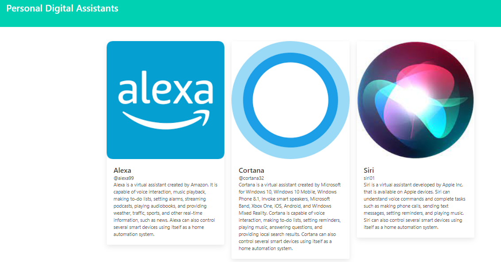

Personal Digital Assistants
This is a simple React app that displays information about three popular personal digital assistants: Alexa, Cortana, and Siri. The app uses the Bulma CSS framework for styling and includes a custom ProfileCard component that takes in information about each digital assistant and displays it in a card format.

How to use
To use this app, simply clone the repository and run npm install to install the necessary dependencies. Then, run npm start to start the development server and view the app in your browser.

Components
ProfileCard
The ProfileCard component is used to display information about each personal digital assistant. It takes in the following props:

title: the name of the personal digital assistant (e.g. "Alexa")
handle: the username or handle of the personal digital assistant (e.g. "@alexa99")
image: the path to an image of the personal digital assistant
description: a brief description of the personal digital assistant and its capabilities
Dependencies
This app uses the following dependencies:

bulma: a CSS framework for styling
react: a JavaScript library for building user interfaces
Credits
This app was created by [your name or username] using React and the Bulma CSS framework. The images of Alexa, Cortana, and Siri are the property of Amazon, Microsoft, and Apple, respectively.

